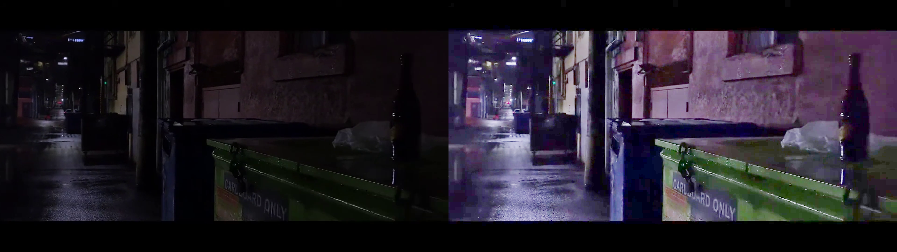

# Low-Light Video Enhancement

This repository provides a lightweight model for video quality enhancement in low light scenioras.

## Requirements

To set up the environment, clone the repository and install the necessary packages:

```bash
conda create --name lowlight_conda

conda activate lowlight_conda

pip3 install ipykernel

python3 -m ipykernel install --user --name lowlight_conda --display-name lowlight_conda

pip3 install -r requirements.txt
```

## Data

The [demo.mp4](./demo.mp4) from Internet (Only for demo purpose)

Please prepare your own video clip for demo.

## Usage

To run the model on a video, use the following command:

```bash
python3 ./test_video.py
```

The scripts will save the visualized results.

### Visualized Image



*Note: This is a demonstration. For higher accuracy, please customize the training strategy.*

## References

The torch weight is from [Zero-Dce](https://github.com/Li-Chongyi/Zero-DCE)

